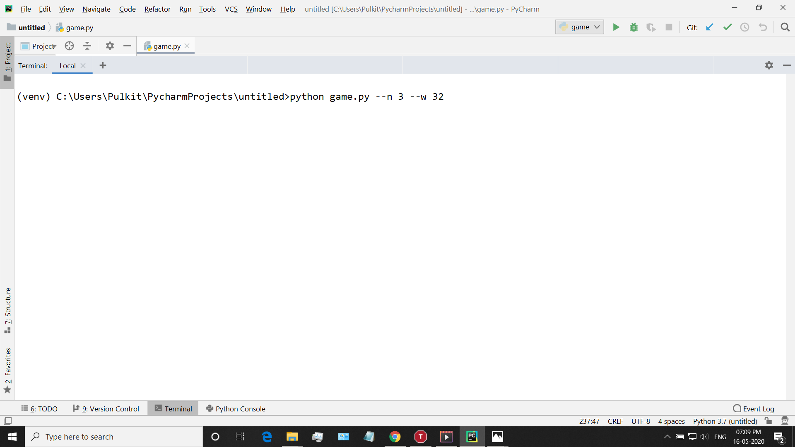
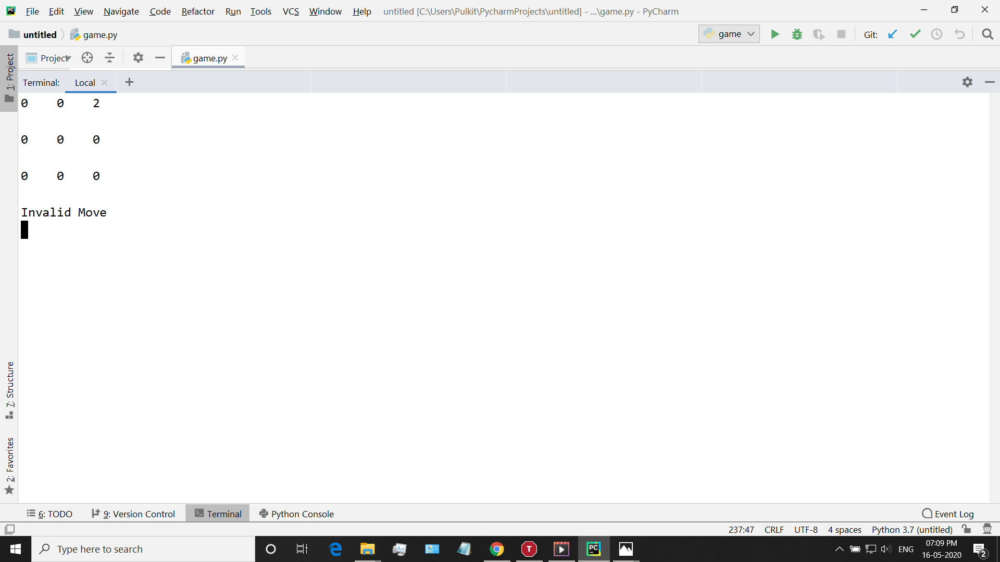
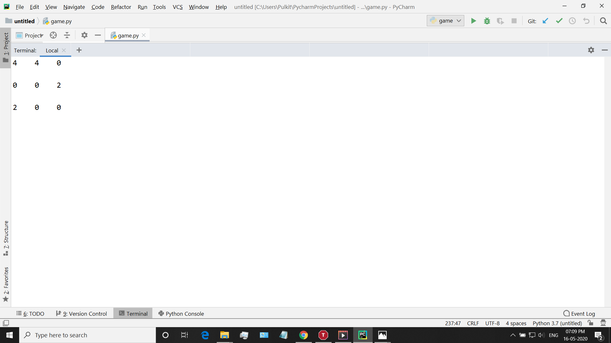
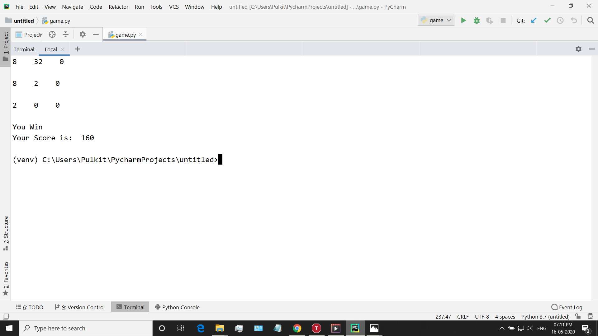

This is the Python Terminal implementation of the popular game 2048.
It gets the size of board and winning number from the user as a command line argument
and then the user can play using WASD or the arrow keys(tested only on windows)
If the user passes a winning number that isn't a power of 2, then it rounds it off using logarithm and round.
Tested on Windows 10 PyCharm.
keyboard library separately installed using pip 
<HTML>
    
    
    
    

</HTML>