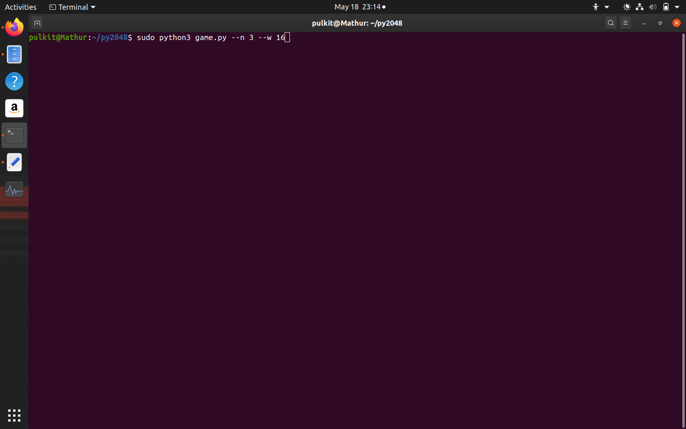
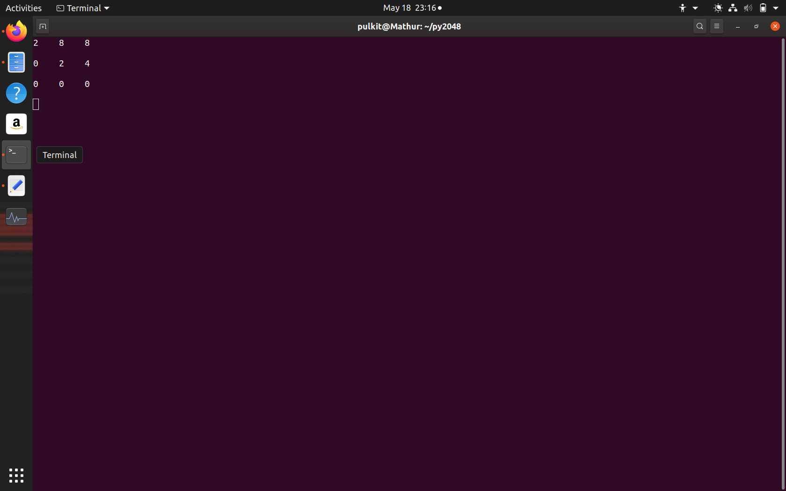
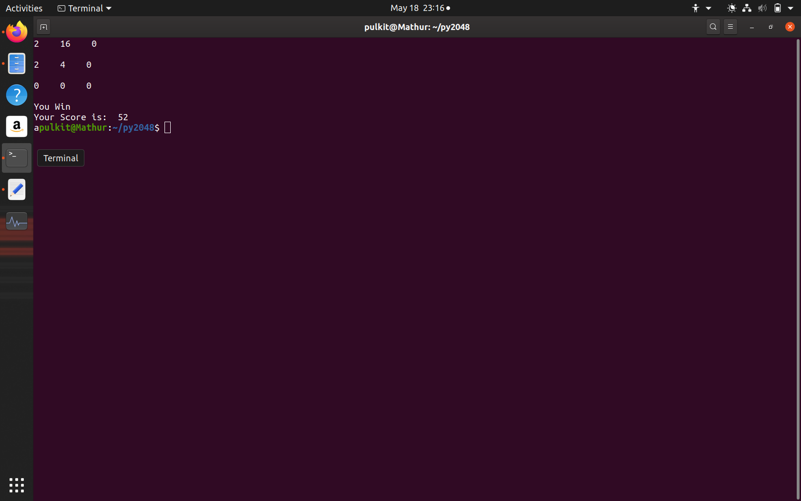

This is the Python Terminal implementation of the popular game 2048.
It gets the size of board and winning number from the user as a command line argument
and then the user can play using WASD or the arrow keys(Works only on windows)
If the user passes a winning number that isn't a power of 2, then it rounds it off using logarithm and round.
Tested on Windows 10 PyCharm Terminal and Ubuntu 19(sudo access required for keyboard library).
Keyboard library has been shipped with the code as Ubuntu isn't able to recognise installation of keyboard even after using pip.
keyboard library separately installed using pip.
To play the game, run the following on terminal:
Windows: python game.py --n boardsize --w winningnumber
Ubuntu: sudo python3 game.py --n boardsize --w winningnumber
If the winning number specified isn't an integral power of 2, it rounds it off to the nearest power.
<HTML>
    <h1>Screenshots</h1>
    <h2>Windows:</h2>
    
    
    
    
    <h2>Ubuntu:</h2>
    
    
    
    
    <h3>Known Issues:</h3>
</HTML>
1. Sometimes the keypresses might be displayed when using Ubuntu Terminal.
2. The keypresses displayed in Ubuntu might also get printed in between the gameboard.
